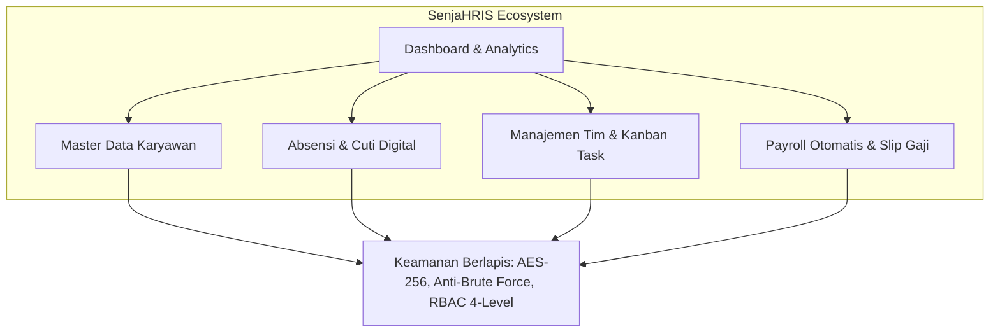

# 📄 PROPOSAL PENAWARAN & PRODUCT WALKTHROUGH
## Solusi Transformasi Digital SDM Terpadu: SenjaHRIS

**Dipersiapkan untuk**: Manajemen & Direksi Perusahaan Calon Klien  
**Tanggal**: 24 Agustus 2026  
**Versi Sistem**: SenjaHRIS v1.0.0 (Enterprise Ready)  
**Status Pengujian**: ✅ 100% Passed (34 Skenario Pengujian QA Lolos)

---

## Executive Summary

Di era industri modern yang serba cepat, pengelolaan Sumber Daya Manusia (SDM) yang masih bergantung pada pencatatan manual (*spreadsheet*, form kertas, rekap absensi fingerprint fisik) menjadi sumber utama inefisiensi, kebocoran biaya operasional, dan risiko kesalahan hitung penggajian (*payroll miscalculation*).

**SenjaHRIS** hadir sebagai platform *Human Resource Information System* (HRIS) generasi baru berbasis web (*cloud & on-premise ready*) yang mengintegrasikan seluruh siklus manajemen karyawan—mulai dari absensi real-time, pengajuan cuti digital, manajemen proyek & tim, hingga kalkulasi penggajian otomatis berstandar perbankan.



---

## 🌟 Keunggulan Utama Sistem (*Key Value Proposition*)

### 1. ⚡ Efisiensi Administratif Hingga 80%
Mengeliminasi proses manual berulang. Rekap absensi dan proses payroll bulanan yang biasanya memakan waktu **3–5 hari kerja** dapat diselesaikan dalam waktu **kurang dari 1 jam**.

### 2. 🛡️ Keamanan Data Kelas Enterprise (*Bank-Grade Security*)
Perusahaan Anda memiliki kendali penuh atas kerahasiaan data karyawan dan nominal gaji:
* **Enkripsi Rekening Bank (AES-256-CBC at Rest)**: Nomor rekening dan informasi finansial dienkripsi di database MySQL. Data terlindung mutlak meskipun database bocor atau dicuri.
* **Anti-Brute Force Login (Rate Limiter)**: Pembatasan ketat percobaan login (maks 5x/menit) dengan respons otomatis `HTTP 429 Too Many Requests`.
* **Proteksi Isolasi Folder Upload**: Folder penyimpanan aset diproteksi dengan aturan `.htaccess` khusus yang memblokir eksekusi seluruh jenis skrip (`.php`, `.phtml`, `.cgi`, `.sh`).
* **Role-Based Access Control (RBAC 4 Tingkat)**: Pembagian hak akses granular untuk *Manager (41 perms)*, *HR (30 perms)*, *Finance (17 perms)*, dan *Employee (22 perms)*.

### 3. 🎯 100% Akurasi Penggajian & Kepatuhan Pajak
Kalkulasi komponen gaji pokok, tunjangan, uang lembur, dan potongan kehadiran dilakukan secara otomatis oleh sistem tanpa risiko kesalahan rumus manual (*Zero Human Error*).

### 4. 📱 Employee Self-Service (ESS) yang Ramah Pengguna
Karyawan dapat secara mandiri melakukan *Clock-In/Clock-Out*, mengajukan cuti, melihat status approval, serta mengunduh slip gaji resmi berformat PDF kapan saja melalui peramban web tanpa membebani staf HR.

---

## 🔍 Walkthrough Fitur & Modul Sistem

```
┌─────────────────────────────────────────────────────────────────────────────┐
│                             MODUL UTAMA SENJAHRIS                           │
├───────────────────────┬───────────────────────────┬─────────────────────────┤
│ 1. Core HR & Org      │ 2. Time & Attendance      │ 3. Compensation & Pay   │
│ • Struktur Tim        │ • Live Clock In/Out       │ • Payroll Generator     │
│ • Profil Lengkap      │ • Statistik Kehadiran     │ • Slip Gaji Digital     │
│ • Manajemen Dokumen   │ • Pengajuan Cuti Digital  │ • Ekspor Rekap Excel    │
└───────────────────────┴───────────────────────────┴─────────────────────────┘
```

### Modul 1: Dashboard Eksekutif & Analytics
* **Metrik Real-time**: Menampilkan total karyawan aktif, persentase kehadiran hari ini, statistik pengajuan cuti tertunda, dan performa proyek.
* **Quick Actions Berbasis Peran**: Tombol pintas cerdas yang hanya muncul sesuai wewenang login pengguna (misal: tombol *Approve Leave* hanya muncul untuk HR/Manager).
* **Grafik Tren Performa**: Visualisasi data interaktif menggunakan *ApexCharts* untuk memantau produktivitas departemen dari bulan ke bulan.

### Modul 2: Manajemen Organisasi & Tim (Our Teams)
* **Visualisasi Struktur**: Pembagian departemen (Engineering, Marketing, HR, Finance, Operations, Sales) dengan penunjukan Team Lead.
* **Manajemen Anggota Tim**: Alokasi karyawan ke dalam tim kerja spesifik dengan pelacakan kapasitas beban kerja.
* **Statistik Tim**: Metrik rata-rata kehadiran dan persentase penyelesaian tugas per tim.

### Modul 3: Direktori & Profil Karyawan (Employee Master Data)
* **Profil Komprehensif 4 Tab**:
  1. *Personal Details*: NIK/KTP, Tempat/Tgl Lahir, Jenis Kelamin, Alamat Domisili, Kontak.
  2. *Job Information*: Status Kontrak (Full-Time, Contract, Probation, Internship), Lokasi Kerja (Onsite, Remote, Hybrid), Tanggal Masuk, Posisi Jabatan.
  3. *Bank & Financial*: Nama Bank, Nomor Rekening (Terenkripsi AES-256), Nama Pemilik Rekening.
  4. *Emergency Contacts*: Nama Kontak Darurat, Hubungan Keluarga, Nomor Telepon Aktif.
* **Avatar & Manajemen Foto**: Pengelolaan foto profil karyawan yang terkompresi secara optimal.

### Modul 4: Absensi & Manajemen Waktu (Attendance Tracking)
* **Pencatatan Kehadiran Cepat**: Karyawan mencatat jam masuk (*Check-In*) dan jam pulang (*Check-Out*) dengan 1 klik.
* **Rekapitulasi Otomatis**: Menghitung otomatis hari hadir, sakit, izin, dan persentase kehadiran bulanan.
* **Filter Rekap HR**: HR dapat menyaring absensi berdasarkan rentang tanggal, departemen, atau karyawan tertentu.

### Modul 5: Manajemen Cuti & Izin (Leave Request Workflow)
* **Katalog Jenis Cuti Lengkap**: Cuti Tahunan, Cuti Sakit, Cuti Melahirkan, Cuti Menikah, Izin Khusus, dll.
* **Alur Persetujuan Digital**: Pengajuan langsung masuk ke dashboard atasan/HR dengan status *Pending*, *Approved*, atau *Rejected* disertai catatan penolakan.
* **Pencegahan Overlapping**: Sistem secara cerdas memvalidasi tanggal agar tidak terjadi duplikasi pengajuan di tanggal yang sama.

### Modul 6: Penggajian & Slip Gaji Digital (Payroll & Payslip)
* **Pembuatan Periode Gaji Massal**: Finance dapat memproses payroll seluruh karyawan dalam satu klik berdasarkan data absensi.
* **Rincian Gaji Transparan**: Rincian gaji pokok, tunjangan jabatan, bonus, potongan ketidakhadiran, dan pajak.
* **Slip Gaji Mandiri Karyawan**: Karyawan dapat langsung melihat dan mengunduh slip gaji mereka sendiri via menu *My Payslips*.
* **Ekspor Excel Multi-Format**: Laporan rekapitulasi gaji siap pakai untuk keperluan audit internal maupun *payroll batch transfer* ke bank.

### Modul 7: Kolaborasi Proyek & Kanban Task Board
* **Manajemen Proyek**: Pelacakan status proyek (*Planning, In Progress, Completed, On Hold*).
* **Kanban Task Board**: Visualisasi tugas dengan penentuan *Priority* (Urgent, High, Medium, Low) dan *Status* (To Do, In Progress, Review, Done).

---

## 💻 Keunggulan Arsitektur & Teknologi (*Tech Stack*)

| Lapisan Sistem | Teknologi Terpilih | Keunggulan untuk Perusahaan |
| :--- | :--- | :--- |
| **Backend Engine** | **Laravel 12 (PHP 8.2+)** | Arsitektur *Enterprise Repository Pattern*, performa tinggi, kestabilan jangka panjang, dan dukungan komunitas terbesar di dunia. |
| **Frontend UI** | **Vue 3 (Composition API) + Vite 5** | *Single Page Application* yang super cepat, navigasi tanpa reload halaman, dan konsumsi bandwidth server yang sangat rendah. |
| **Styling & Design** | **Tailwind CSS + Lucide Icons** | Tampilan antarmuka korporat modern, *pixel-perfect*, responsif di desktop maupun tablet/smartphone. |
| **Database** | **MySQL 8.0** | Integritas data relasional yang ketat dengan indeks query teroptimasi (*sub-second response time*). |
| **Kualitas Teruji** | **Automated QA Suite** | Telah melewati uji stres otomatis dengan skor **100% Lolos Uji (34/34 Test Cases Passed)**. |

---

## 💰 Paket Penawaran Harga & Skema Investasi

Kami menawarkan model implementasi yang fleksibel sesuai kebutuhan skala bisnis Anda:

### OPSI A: Cloud SaaS (Software-as-a-Service)
*Sangat cocok untuk perusahaan yang menginginkan implementasi instan tanpa perlu repot mengelola server fisik.*

| Paket | Rentang Karyawan | Biaya Investasi | Fasilitas Termasuk |
| :--- | :---: | :---: | :--- |
| **Starter** | 1 – 25 Karyawan | **Rp 450.000 / bulan** | Seluruh Modul Core, Cloud Server Hosting, SSL Certificate, Update Otomatis. |
| **Business** | 26 – 75 Karyawan | **Rp 950.000 / bulan** | Seluruh Modul Core + Payroll + Kanban, Backup Harian, Prioritas Support Email/WA. |
| **Growth** | 76 – 200 Karyawan | **Rp 1.850.000 / bulan** | Kapasitas tak terbatas, Dedicated Account Manager, Training Karyawan Online. |

---

### OPSI B: On-Premise / Enterprise One-Time License
*Sangat cocok untuk perusahaan skala menengah-besar yang mewajibkan seluruh database tersimpan di server lokal / private cloud internal perusahaan (100% Data Sovereignty).*

| Komponen Penawaran | Detail Spesifikasi | Biaya Investasi (One-Time) |
| :--- | :--- | :---: |
| **Lisensi Perangkat Lunak SenjaHRIS** | Full Source Code (Frontend + Backend), Akses Pengguna Tak Terbatas (*Unlimited Users*), *White-labeling* (Kustomisasi Nama & Logo Perusahaan). | **Rp 45.000.000** |
| **Instalasi & Deployment Server** | Setup di Server / Cloud Klien (AWS / Google Cloud / Server Lokal), Konfigurasi Database & Keamanan. | **Rp 5.000.000** |
| **Pelatihan & Migrasi Data Awal** | Training Admin HR & Finance (Online/Onsite), Impor Data Karyawan Awal dari Excel. | **Rp 3.500.000** |
| **Total Investasi Awal** | *Semua paket di atas (Termasuk Garansi Bug Fixes 6 Bulan)* | **Rp 53.500.000** *(One-time)* |

*(Opsional: Maintenance & Support SLA Tahunan setelah 6 bulan garansi: Rp 7.500.000 / tahun).*

---

## ⏱️ Timeline Implementasi Sistem (Hanya 10 Hari Kerja)

```
Hari 1 - 2   : Kickoff Meeting & Pengumpulan Data Struktur Organisasi
Hari 3 - 4   : Setup Lingkungan Server, Domain, & Konfigurasi Keamanan
Hari 5 - 6   : Migrasi Data Karyawan & Pengaturan Komponen Payroll
Hari 7 - 8   : UAT (User Acceptance Testing) bersama Tim HR & Finance
Hari 9 - 10  : Training Pengguna (Admin & Karyawan) + Sistem Resmi Go-Live
```

---

## 📞 Alur Tindak Lanjut & Jadwal Demo

Kami siap membawakan sesi **Live Interactive Demo** di hadapan jajaran Direksi dan Tim HR perusahaan Anda. Silakan hubungi kami untuk mendiskusikan jadwal:

* **Penanggung Jawab**: Tim Solusi Bisnis & Teknologi SenjaHRIS
* **Email**: `support@senjahris.com` / `admin@senjahris.com`
* **Dokumen Teknis Terlampir**:
  * 🧪 [Laporan Pengujian Kualitas Sistem (`report/QA_TEST_REPORT.md`)](./QA_TEST_REPORT.md)
  * 📖 [Dokumentasi Lengkap Sistem (`report/PROJECT_DOCUMENTATION.md`)](./PROJECT_DOCUMENTATION.md)
