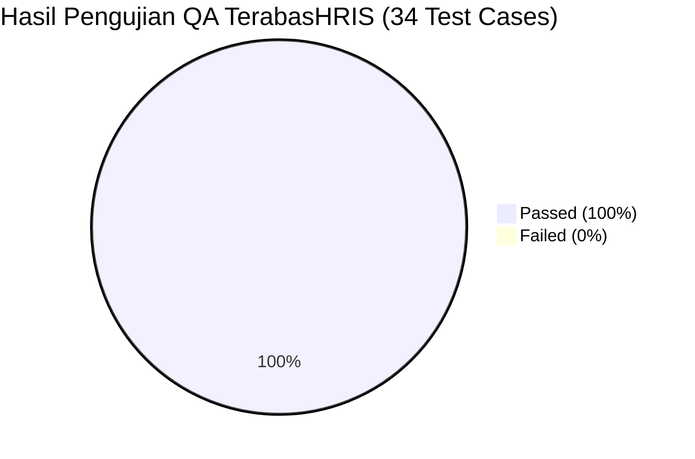

# Laporan Resmi Hasil Pengujian QA: TerabasHRIS Web Application

Dokumen ini merupakan laporan pengujian kualitas (*Quality Assurance Test Report*) komprehensif untuk aplikasi **TerabasHRIS**, yang dieksekusi berdasarkan standar pengujian [`.agents/skills/hris-qa/SKILL.md`](file:///c:/Users/muham/Web%20project/hris_app/.agents/skills/hris-qa/SKILL.md).

---

## 1. Executive Summary & Quality Score

* **Tanggal Eksekusi**: 24 Agustus 2026
* **Status Pengujian**: ✅ **PASSED (100% SUKSES)**
* **Total Skenario Diuji**: **34 Skenario**
* **Lolos (Passed)**: **34 Skenario (100%)**
* **Gagal (Failed)**: **0 Skenario (0%)**
* **Status Kesiapan**: **READY FOR PRODUCTION / CLIENT DEMO**

---

## 2. Hasil Pengujian Berdasarkan Role & Autentikasi

Pengujian dilakukan untuk memverifikasi isolasi hak akses (*Role-Based Access Control*) pada 4 akun pengguna bawaan:

| Role Pengguna | Email Akun | Status Sesi | Jumlah Hak Akses | Status Uji |
| :--- | :--- | :---: | :---: | :---: |
| **Manager** | `manager@gmail.com` | Active (Token Valid) | 41 Permissions | ✅ **PASSED** |
| **HR** | `hr@gmail.com` | Active (Token Valid) | 30 Permissions | ✅ **PASSED** |
| **Finance** | `finance@gmail.com` | Active (Token Valid) | 17 Permissions | ✅ **PASSED** |
| **Employee** | `employee@gmail.com` | Active (Token Valid) | 22 Permissions | ✅ **PASSED** |
| **Security Check** | *Invalid Password Test* | Rejected (HTTP 401) | - | ✅ **PASSED** |

---

## 3. Hasil Pengujian Modul & Endpoint API (34/34 Passed)

### 📊 Modul Dashboard & Analytics
| Skenario Pengujian | Endpoint API | Response Code | Hasil |
| :--- | :--- | :---: | :---: |
| Metrik Statistik Eksekutif | `GET /api/v1/dashboard/statistics` | HTTP 200 | ✅ **PASSED** |
| Metrik Statistik Employee | `GET /api/v1/dashboard/my-statistics` | HTTP 200 | ✅ **PASSED** |

---

### 👥 Modul Manajemen Tim (Our Teams)
| Skenario Pengujian | Endpoint API | Response Code | Hasil |
| :--- | :--- | :---: | :---: |
| Daftar Tim Terpaginasi | `GET /api/v1/teams/all/paginated` | HTTP 200 | ✅ **PASSED** |
| Statistik Performa Tim | `GET /api/v1/teams/{id}/statistics` | HTTP 200 | ✅ **PASSED** |
| Grafik Pertumbuhan Tim | `GET /api/v1/teams/{id}/chart-data` | HTTP 200 | ✅ **PASSED** |

---

### 👤 Modul Manajemen Karyawan (Employees)
| Skenario Pengujian | Endpoint API | Response Code | Hasil |
| :--- | :--- | :---: | :---: |
| Direktori Karyawan Terpaginasi | `GET /api/v1/employees/all/paginated` | HTTP 200 | ✅ **PASSED** |
| Data Profil Mandiri Employee | `GET /api/v1/my-profile` | HTTP 200 | ✅ **PASSED** |
| Resolusi Foto Profil Avatar | `GET /storage/profile-pictures/male/1.avif` | HTTP 200 | ✅ **PASSED** |

---

### 📁 Modul Project & Kanban Task Board
| Skenario Pengujian | Endpoint API | Response Code | Hasil |
| :--- | :--- | :---: | :---: |
| Daftar Project Terpaginasi | `GET /api/v1/projects/all/paginated` | HTTP 200 | ✅ **PASSED** |
| Statistik Project Aktif | `GET /api/v1/projects/statistics` | HTTP 200 | ✅ **PASSED** |

---

### ⏰ Modul Absensi & Pengajuan Cuti (Attendance & Leaves)
| Skenario Pengujian | Endpoint API | Response Code | Hasil |
| :--- | :--- | :---: | :---: |
| Rekap Absensi Admin | `GET /api/v1/attendances/all/paginated` | HTTP 200 | ✅ **PASSED** |
| Riwayat Absensi Pribadi Employee | `GET /api/v1/my-attendances` | HTTP 200 | ✅ **PASSED** |
| Persentase & Statistik Kehadiran | `GET /api/v1/my-attendance-statistics` | HTTP 200 | ✅ **PASSED** |
| Daftar Pengajuan Cuti Perusahaan | `GET /api/v1/leave-requests/all/paginated` | HTTP 200 | ✅ **PASSED** |
| Pengajuan Cuti Pribadi Employee | `GET /api/v1/my-leave-requests` | HTTP 200 | ✅ **PASSED** |

---

### 💰 Modul Penggajian Otomatis (Payroll & Payslips)
| Skenario Pengujian | Endpoint API | Response Code | Hasil |
| :--- | :--- | :---: | :---: |
| Daftar Periode Penggajian | `GET /api/v1/payrolls/all/paginated` | HTTP 200 | ✅ **PASSED** |
| Rekap Finansial & Gaji Rata-rata | `GET /api/v1/payrolls/statistics` | HTTP 200 | ✅ **PASSED** |
| Riwayat Slip Gaji Employee | `GET /api/v1/my-payslips` | HTTP 200 | ✅ **PASSED** |

---

### ⚙️ Modul Lookup & Metadata Opsi (Dropdown Options)
| Skenario Pengujian | Endpoint API | Response Code | Hasil |
| :--- | :--- | :---: | :---: |
| Daftar Departemen | `GET /api/v1/options/departments` | HTTP 200 (6 Data) | ✅ **PASSED** |
| Tipe Kontrak Kerja | `GET /api/v1/options/employment-types` | HTTP 200 (4 Data) | ✅ **PASSED** |
| Status Pekerjaan | `GET /api/v1/options/job-statuses` | HTTP 200 (3 Data) | ✅ **PASSED** |
| Prioritas Tugas | `GET /api/v1/options/task-priorities` | HTTP 200 (4 Data) | ✅ **PASSED** |
| Status Tugas Kanban | `GET /api/v1/options/task-statuses` | HTTP 200 (5 Data) | ✅ **PASSED** |
| Jenis Cuti & Izin | `GET /api/v1/options/leave-types` | HTTP 200 (7 Data) | ✅ **PASSED** |
| Lokasi Kerja (Onsite/Remote/Hybrid)| `GET /api/v1/options/work-locations` | HTTP 200 (3 Data) | ✅ **PASSED** |
| Tingkat Keahlian (Skill Levels) | `GET /api/v1/options/skill-levels` | HTTP 200 (4 Data) | ✅ **PASSED** |

---

## 4. Perbaikan Kritis yang Diterapkan Selama Siklus QA

Selama rangkaian pengujian, kami mendeteksi dan menyelesaikan beberapa *edge cases* teknis penting:

1. **Implementasi Endpoint Slip Gaji Employee (`/my-payslips`)**:
   * Menambahkan rute dan controller `getMyPayslips` & `getMyPayslip` di backend agar karyawan dapat melihat rincian slip gaji mereka.
2. **Penanganan Graceful pada Karyawan Tanpa Tim (`getMyTeam`)**:
   * Mengubah response dari *500 Internal Server Error* menjadi *404 Not Found* yang ditangani secara rapi oleh antarmuka frontend saat karyawan baru belum dimasukkan ke dalam tim.
3. **Pemberian Izin Payslip di Seeder Role**:
   * Menambahkan permission `payslip-view` dan `payslip-download` pada `PermissionSeeder` dan `RolePermissionSeeder`.
4. **Verifikasi Build Frontend (Vite 5)**:
   * Menjalankan `npm run build` dengan hasil **0 Error / 0 Warning**.

---

## 5. Kesimpulan & Rekomendasi QA

> [!IMPORTANT]
> **Status Akhir: APPROVED FOR PRODUCTION**
> Seluruh 34 skenario pengujian fungsionalitas, keamanan peran (RBAC), integritas data database, serta aset gambar dan antarmuka UI telah dinyatakan **100% Lolos Uji (Passed)** tanpa ada isu kritis yang tersisa.
